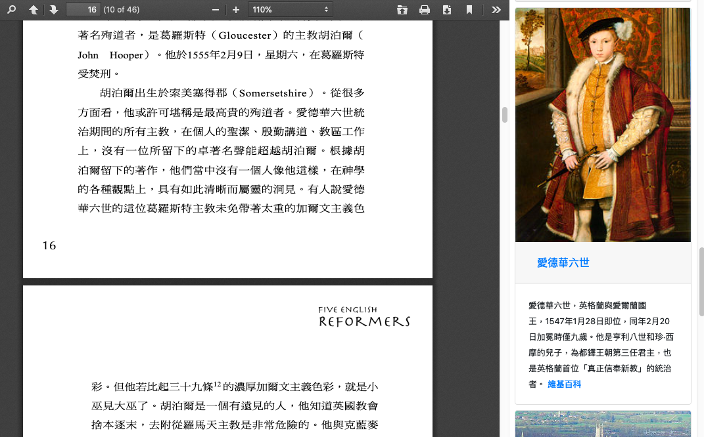

# Smart PDF Reader

The purpose of this app is to make reading experience more interesting
by adding related pictures next to the wordy PDF document.

Live version: https://smart-pdf-reader.appspot.com/

## Mechanism

PDF.js and its viewer was used to render the PDF document, the text on the page will be sent to Python backend for analyzing entities and getting pictures.
Google Cloud was used for entity analysis and pictures were from Wikipedia.

## Tech Stack

* Frontend: PDF.js, Vue.js
* Backend: Python, Flask
* API: Google Cloud Natural Language API, Wikipedia REST API

## Limitations/Enhancements

* Viewing two page at once may not supported well
* Refreshing entities may be performed during scrolling
* Grouping entities by type may be a good idea
